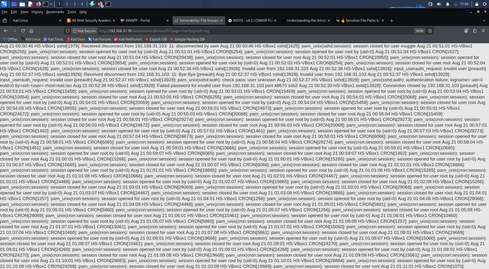
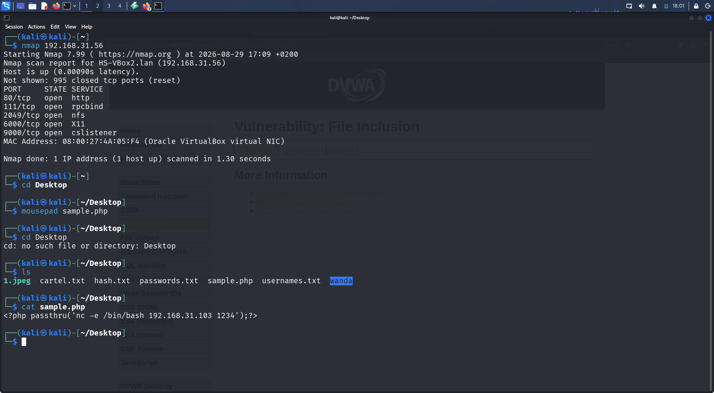
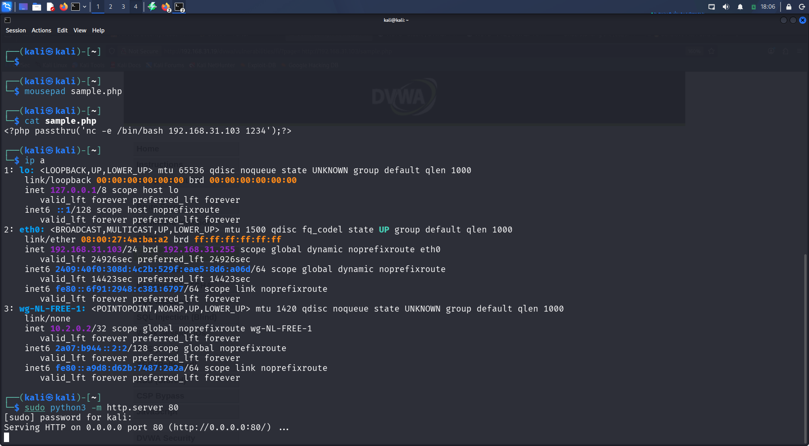
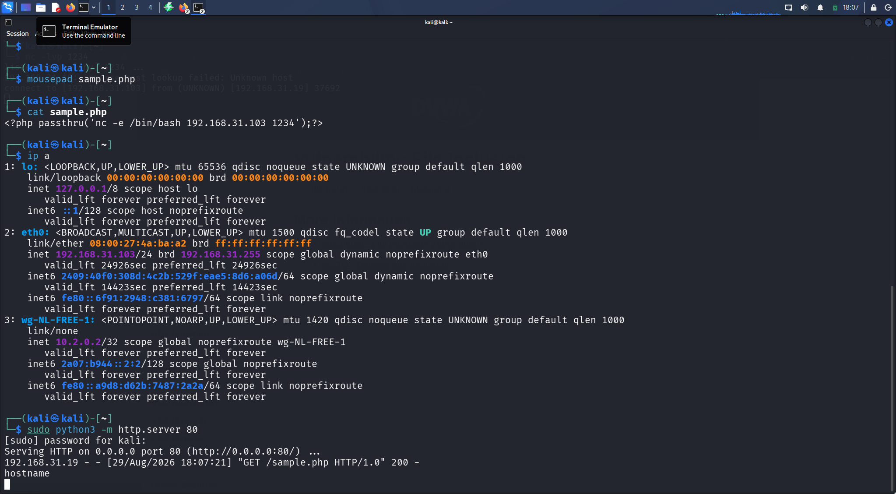
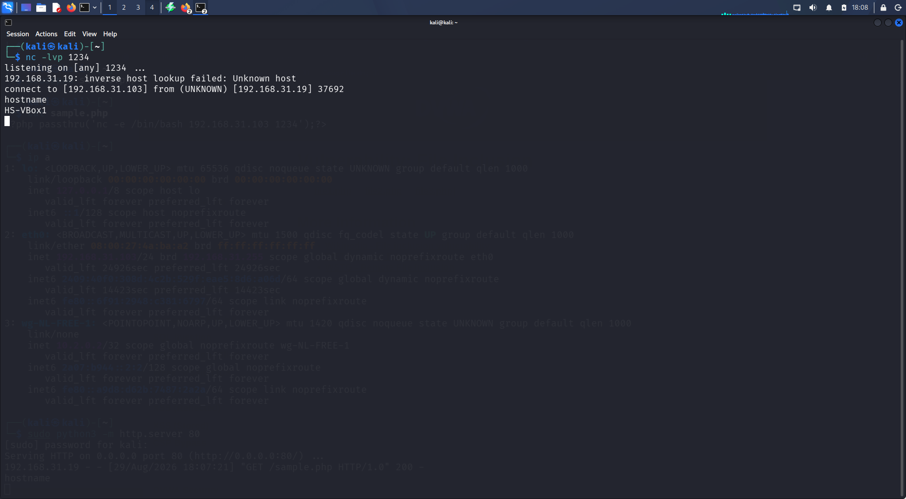
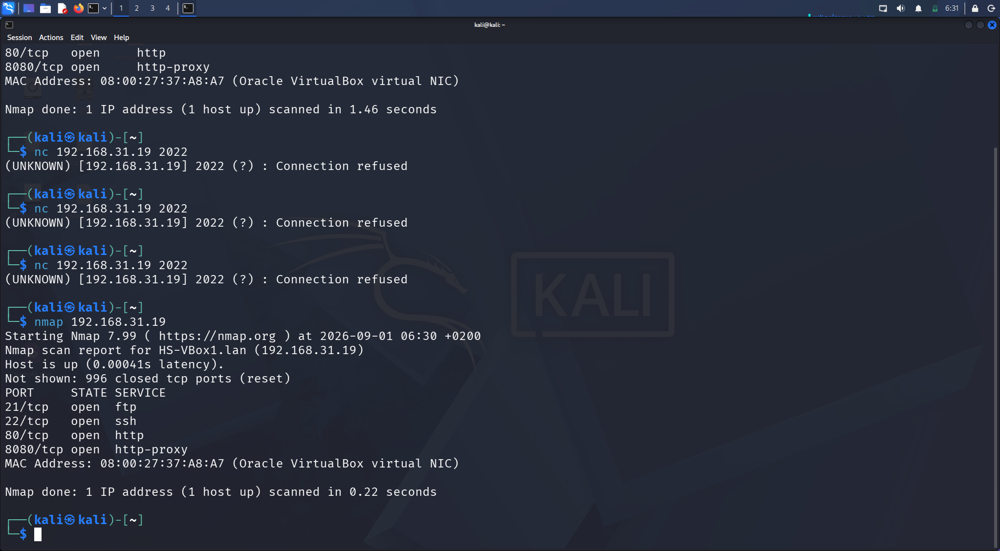
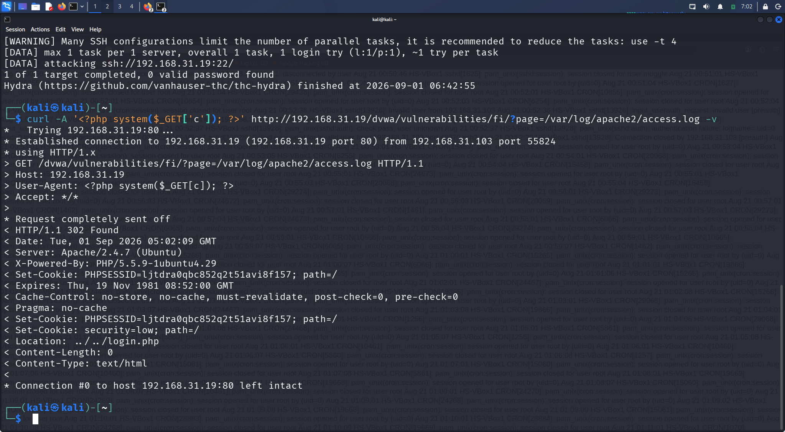
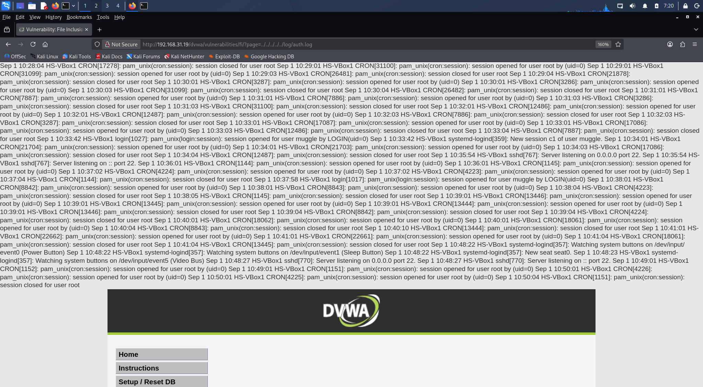
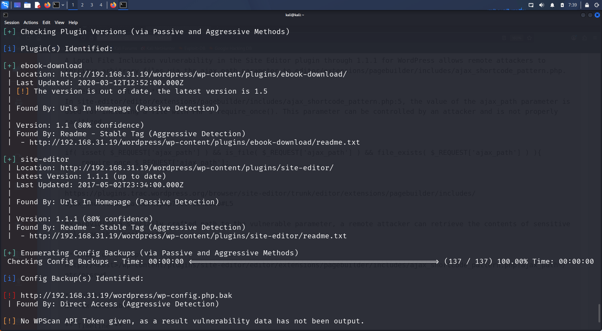
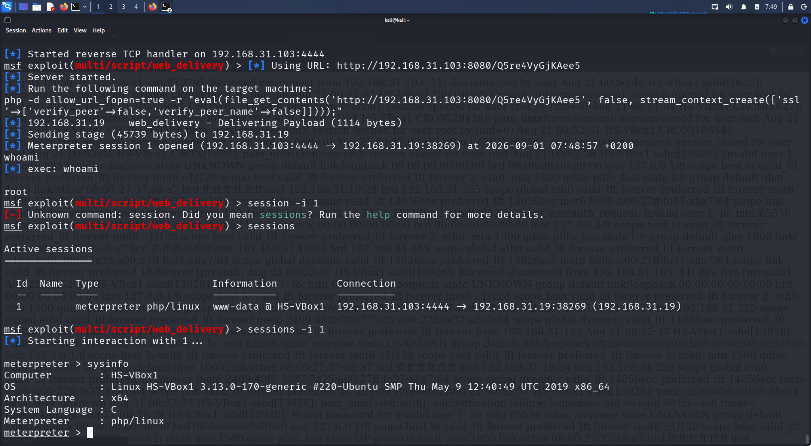

# File Inclusion – Web Application Security Lab

> A hands-on web application security assessment performed against an intentionally vulnerable DVWA instance in an isolated VirtualBox laboratory environment.

## Lab Summary

| Category | Details |
|---|---|
| Vulnerability | File Inclusion |
| Environment | DVWA |
| Testing OS | Kali Linux |
| Web Proxy | Burp Suite |
| Web Server | Apache |
| Browser | Firefox |
| Network | Isolated VirtualBox Lab |
| Testing Type | Authorized security testing |

---

## 1. Overview

This lab documents my hands-on study of File Inclusion vulnerabilities in a controlled and isolated web application security environment.

The objective was to understand how applications that use user-controlled file paths can unintentionally expose local resources or process remotely supplied content.

The practical work was performed against a deliberately vulnerable DVWA instance in a local VirtualBox laboratory network.

---

## 2. Learning Objectives

- Understand File Inclusion vulnerabilities
- Understand Local File Inclusion (LFI)
- Understand Remote File Inclusion (RFI)
- Identify user-controlled parameters involved in file loading
- Analyze HTTP requests and responses
- Understand the security impact of improper input validation
- Practice web application security testing
- Understand defensive controls against File Inclusion
- Document security findings in a structured format

---

## 3. Lab Environment

| Component | Environment |
|---|---|
| Testing Machine | Kali Linux |
| Target | DVWA vulnerable web application |
| Web Server | Apache |
| Proxy | Burp Suite |
| Browser | Firefox |
| Virtualization | VirtualBox |
| Network | Isolated laboratory network |

> All testing was performed against an intentionally vulnerable system in an isolated laboratory environment.

---

## 4. What is File Inclusion?

File Inclusion is a web application vulnerability that occurs when an application uses user-controlled input to determine which file should be loaded.

If the application does not properly validate or restrict the supplied file path, an attacker may be able to access resources outside the application's intended scope.

Two commonly discussed forms are:

- Local File Inclusion (LFI)
- Remote File Inclusion (RFI)

---

## 5. Local File Inclusion (LFI)

LFI occurs when an application allows user-controlled input to reference files located on the target system.

### Concept

```text
User Input
    ↓
File Parameter
    ↓
Application
    ↓
Local File
    ↓
File Contents Disclosed
```

The LFI testing was performed against the vulnerable File Inclusion functionality in DVWA.

The testing process involved:

1. Identifying the File Inclusion functionality in DVWA.
2. Identifying the user-controlled file parameter.
3. Testing whether a local file could be referenced through the parameter.
4. Observing the application's response.
5. Confirming that local file contents could be disclosed.
6. Capturing screenshot evidence of the successful local file disclosure.

### LFI Evidence

The following screenshot documents the successful local file disclosure demonstrated during the lab.



**Evidence:** `evidence/01-lfi-local-file-disclosure.png`

---

## 6. LFI Security Impact

Successful LFI can allow an attacker to access files that were not intended to be exposed through the web application.

Potential impact includes:

- Disclosure of sensitive local files
- Exposure of application configuration
- Exposure of system information
- Exposure of credentials or secrets stored in accessible files
- Potential chaining with other vulnerabilities

---

## 7. LFI Root Cause

The vulnerability exists because user-controlled input is used to determine which local resource should be loaded without sufficient validation or restriction.

Common contributing factors include:

- Insufficient input validation
- Unsafe dynamic file loading
- Lack of allowlisting
- Inadequate filesystem restrictions
- Excessive application privileges

---

## 8. Remote File Inclusion (RFI)

RFI testing was performed against the vulnerable File Inclusion functionality using a controlled resource hosted from the Kali Linux testing machine.

A test resource was created and hosted through a local HTTP server within the isolated laboratory network. The DVWA application was then tested to determine whether it would request and process the remotely hosted resource.

### RFI Testing Flow

```text
Kali Testing Machine
        ↓
Controlled Test Resource
        ↓
HTTP Server
        ↓
DVWA File Inclusion Parameter
        ↓
Target Requests Remote Resource
        ↓
Controlled Connection
```

The RFI testing process involved:

1. Creating a controlled test resource on the Kali Linux testing machine.
2. Identifying the IP address used by the Kali machine in the laboratory network.
3. Starting a Python HTTP server to host the controlled resource.
4. Supplying the remotely hosted resource through the vulnerable File Inclusion functionality.
5. Observing the request received by the HTTP server.
6. Verifying the resulting controlled connection.
7. Capturing screenshots documenting the RFI testing process.

### RFI Evidence

#### 8.1 Test File and IP Configuration

The following evidence documents the controlled test file and IP configuration used during the RFI testing process.



**Evidence:** `evidence/01-rfi-test-file-and-ip.png`

---

#### 8.2 HTTP Server

The following evidence shows the HTTP server used to host the controlled test resource.



**Evidence:** `evidence/02-rfi-http-server.png`

---

#### 8.3 Reverse Connection

The following evidence documents the controlled reverse connection observed during the RFI demonstration.



**Evidence:** `evidence/03-rfi-reverse-connection.png`

---

#### 8.4 Supporting Terminal Evidence

The following screenshot provides additional terminal evidence supporting the RFI testing workflow.



**Evidence:** `evidence/04-rfi-supporting-terminal.png`

---

## 9. Advanced File Inclusion Testing

This section documents additional File Inclusion techniques explored in the isolated laboratory environment.

### 9.1 SSH Log Poisoning

The lab explored how log files can become relevant to File Inclusion testing when attacker-controlled input is written into an accessible log and the application subsequently includes that log file.

The testing was performed only against the intentionally vulnerable laboratory environment.

### SSH Log Poisoning Testing

The testing process involved:

1. Identifying the SSH service exposed by the laboratory target.
2. Testing the application's ability to access the relevant authentication log.
3. Introducing controlled test input into the laboratory environment.
4. Using the File Inclusion functionality to access the resulting log content.
5. Observing how the application processed the included log file.
6. Capturing evidence of the testing process.

### SSH Log Poisoning Evidence



**Evidence:** `evidence/05-ssh-log-poisoning.png`

---

### 9.2 HTTP Log Poisoning

HTTP log poisoning was also explored using the vulnerable File Inclusion functionality.

The objective was to understand how attacker-controlled HTTP request data may become recorded in a web-server log and subsequently become relevant to a File Inclusion condition.

### HTTP Log Poisoning Testing

The testing process involved:

1. Identifying the Apache access log used by the laboratory web server.
2. Sending controlled HTTP request data to the target.
3. Verifying that the request data was recorded in the web-server log.
4. Using the File Inclusion functionality to access the log.
5. Observing the resulting application response.
6. Capturing evidence of the testing process.

### HTTP Log Poisoning Evidence



**Evidence:** `evidence/06-http-log-poisoning.png`

---

### 9.3 Path Traversal

Path traversal was explored as another method of accessing files outside the application's intended directory.

The testing demonstrated that insufficient access restrictions can allow a user-controlled file parameter to reference resources outside the expected application directory.

### Path Traversal Testing

The testing process involved:

1. Identifying the vulnerable File Inclusion parameter.
2. Testing directory traversal through the parameter.
3. Observing the application's response.
4. Confirming access to an accessible file outside the expected directory.
5. Capturing evidence of the result.

### Path Traversal Evidence



**Evidence:** `evidence/07-path-traversal.png`

---

### 9.4 WordPress Enumeration and LFI Research

The lab also included testing of a WordPress environment containing the Site Editor plugin.

The plugin and version information were identified during WordPress enumeration. Publicly documented research was then reviewed to understand the associated Local File Inclusion condition.

The testing was performed against the intentionally vulnerable laboratory WordPress installation.

### WordPress LFI Testing

The testing process involved:

1. Enumerating the WordPress installation.
2. Identifying installed plugins and their versions.
3. Identifying the Site Editor component.
4. Reviewing the documented LFI condition associated with the component.
5. Testing the vulnerable functionality within the isolated laboratory environment.
6. Capturing evidence of the testing process.

### WordPress Enumeration Evidence



**Evidence:** `evidence/08-wordpress-wpscan.png`

---

### 9.5 Controlled Session Evidence

The final stage of the laboratory exercise demonstrated the resulting controlled session from the vulnerable environment.

This evidence is included to document the security impact of chaining File Inclusion with additional execution conditions in the isolated lab.



**Evidence:** `evidence/09-controlled-session.png`

---

## 10. Security Impact

| Vulnerability | Impact |
|---|---|
| LFI | Local file disclosure |
| RFI | Remote resource inclusion |
| Improper input validation | User-controlled file/resource loading |
| Unsafe file handling | Potential further exploitation depending on configuration |

> The actual impact of File Inclusion vulnerabilities depends on application configuration, filesystem permissions, server privileges, and other security controls.

---

## 11. Defensive Recommendations

- Use strict input validation.
- Prefer allowlisting of permitted files/resources.
- Avoid directly using user input in filesystem operations.
- Restrict web-server filesystem permissions.
- Disable unnecessary remote inclusion functionality.
- Apply least-privilege principles.
- Monitor and log suspicious file inclusion requests.
- Use secure application architecture that does not require arbitrary file paths.

---

## 12. Key Takeaways

This lab provided practical experience with:

- Local File Inclusion testing
- Remote File Inclusion testing
- File parameter analysis
- Local file disclosure
- Remote resource hosting
- HTTP request observation
- Log analysis
- Path traversal testing
- WordPress security scanning
- Controlled connection testing
- Evidence collection
- Security impact analysis
- Vulnerability documentation
- Defensive remediation

The exercise reinforced the importance of strict input validation, secure file handling, least privilege, and defense-in-depth controls in web applications.

---

## 13. Ethical & Legal Disclaimer

This project was conducted exclusively within an intentionally vulnerable and isolated laboratory environment for educational and cybersecurity training purposes.

The techniques demonstrated in this repository should only be used against systems for which explicit authorization has been obtained.

Unauthorized testing against systems, applications, networks, or infrastructure may be illegal.
