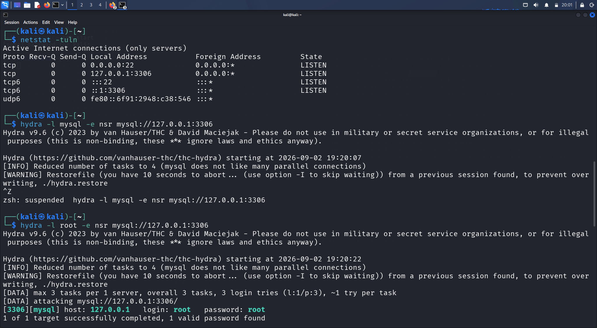
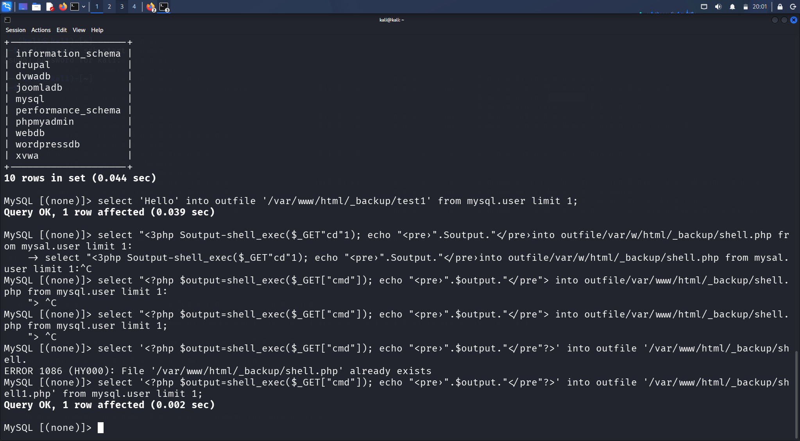
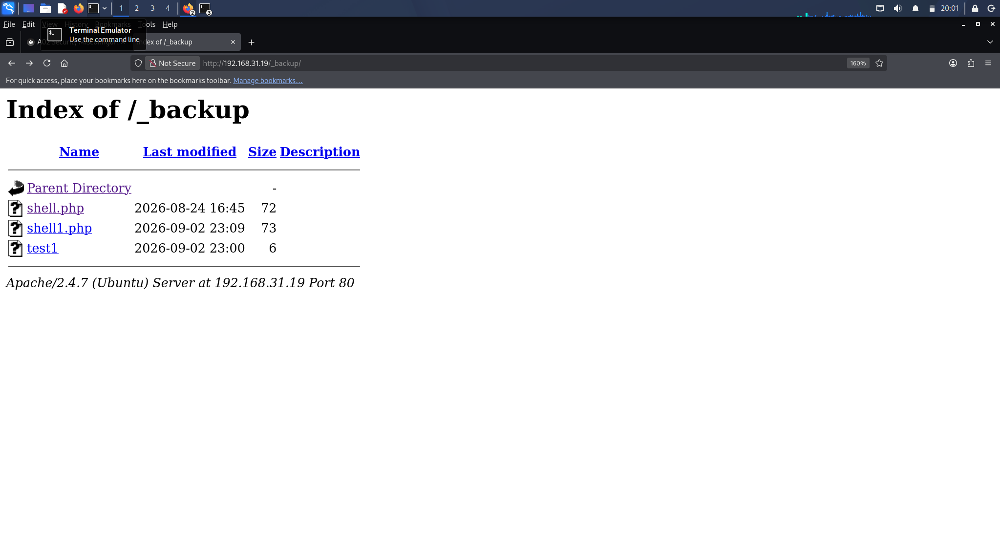
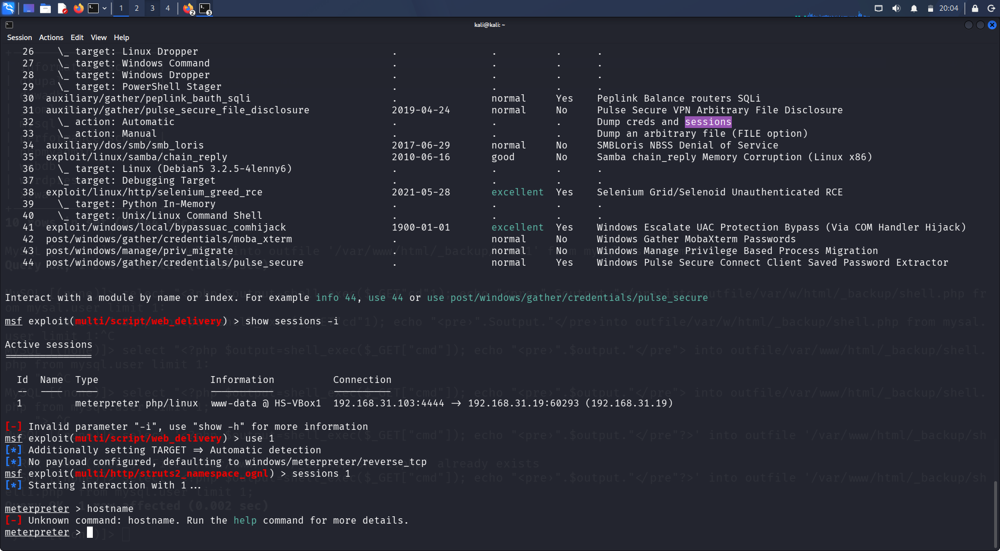

# Security Misconfiguration – Web Application Security Lab

A hands-on web application security assessment performed against intentionally vulnerable systems in an isolated laboratory environment.

## 1. Lab Summary

| Category | Details |
|---|---|
| Vulnerability | Security Misconfiguration |
| Environment | Isolated Cybersecurity Lab |
| Testing OS | Kali Linux |
| Web Proxy | Burp Suite |
| Web Server | Apache |
| Database | MySQL |
| Tools | Nmap, cURL, Hydra, Burp Suite, Metasploit |

---

## 2. Overview

This lab focused on identifying and validating security misconfigurations across web services and supporting infrastructure.

The assessment included service enumeration, identification of exposed services, database access, investigation of an exposed backup directory, HTTP method analysis, and validation of the resulting security impact.

All testing was performed against intentionally vulnerable laboratory systems.

---

## 3. Learning Objectives

The main objectives of this lab were:

- Identify exposed network services.
- Analyze service configurations.
- Investigate unnecessarily exposed functionality.
- Identify insecure database configurations.
- Identify exposed backup resources.
- Analyze supported HTTP methods.
- Understand how configuration weaknesses can increase attack surface.
- Document security impact and remediation recommendations.

---

## 4. Service Enumeration

The assessment began with network and service enumeration to identify the available attack surface.

Example findings included:

- HTTP services
- MySQL database service
- Additional locally accessible services
- Apache web server functionality

Service enumeration helped identify which components required further investigation.

### Enumeration Evidence



**Evidence:** `evidence/01-service-enumeration.png`

---

## 5. Database Security Misconfiguration

The lab environment exposed a MySQL service that could be accessed using the credentials available within the laboratory scenario.

After establishing database access, the available databases were enumerated to understand the accessible data and privileges.

This demonstrated why database services should not be unnecessarily exposed and why strong authentication and access controls are important.

### Database Access Evidence



**Evidence:** `evidence/02-mysql-access.png`

---

## 6. Insecure File and Backup Handling

The assessment identified an exposed backup directory on the web server.

The directory was accessible through the web application and contained backup-related files.

Exposed backup files can disclose:

- Application source code
- Configuration information
- Credentials or secrets
- Database information
- Internal implementation details

This demonstrates the importance of removing development and backup resources from production web directories.

### Backup Directory Evidence



**Evidence:** `evidence/03-backup-directory.png`

---

## 7. HTTP Method Analysis

HTTP methods supported by a web server were also investigated.

An `OPTIONS` request was used to identify the methods advertised by the Apache server.

The laboratory server reported support for:

```text
GET
HEAD
POST
OPTIONS
```
The presence of an HTTP method is not automatically a vulnerability. Security impact depends on how the application implements and authorizes functionality associated with that method.

### HTTP Method Evidence



**Evidence:** `evidence/04-http-methods.png`

---

## 8. Security Impact

The lab demonstrated how multiple configuration weaknesses can combine to increase the overall attack surface.

Potential impacts of security misconfiguration include:

| Misconfiguration | Potential Impact |
|---|---|
| Exposed services | Increased attack surface |
| Weak database access controls | Unauthorized database access |
| Exposed backup files | Source code or sensitive information disclosure |
| Insecure HTTP configuration | Unnecessary application functionality exposure |
| Poor access control | Unauthorized access to resources |
| Development artifacts in web directories | Information disclosure |

The overall impact depends on the privileges available to the affected services and the sensitivity of the exposed resources.

---

## 9. Defensive Recommendations

### Network Security

- Expose only required services.
- Restrict administrative and database services to trusted networks.
- Use firewall rules to limit unnecessary access.
- Regularly review listening services.

### Authentication

- Enforce strong authentication.
- Avoid default or weak credentials.
- Implement account lockout and rate limiting appropriately.
- Apply least-privilege principles.

### Web Server Security

- Disable unnecessary HTTP functionality.
- Remove development and backup files from web-accessible directories.
- Prevent directory listing where it is not required.
- Keep server software updated.
- Use appropriate access-control policies.

### Database Security

- Restrict database services to trusted hosts.
- Use strong, unique credentials.
- Avoid unnecessary administrative privileges.
- Apply least privilege to database accounts.
- Monitor database access.

### File Management

- Do not store backups inside public web directories.
- Protect configuration files and application source code.
- Remove temporary and development files before deployment.

---

## 10. Key Takeaways

This lab provided practical experience with:

- Network service enumeration
- Security misconfiguration analysis
- MySQL service assessment
- Web-server configuration analysis
- Backup-file exposure
- HTTP method enumeration
- Access-control considerations
- Attack-surface analysis
- Evidence collection
- Security impact assessment
- Defensive remediation

The exercise reinforced that security weaknesses are not always caused by a single software vulnerability. Incorrect configuration, excessive privileges, exposed resources, and unnecessary services can collectively create significant security risk.

---

## 11. Ethical & Legal Disclaimer

This project was conducted exclusively within an intentionally vulnerable and isolated laboratory environment for educational and cybersecurity training purposes.

The techniques demonstrated in this repository should only be used against systems for which explicit authorization has been obtained.

Unauthorized testing against systems, applications, networks, or infrastructure may be illegal.
