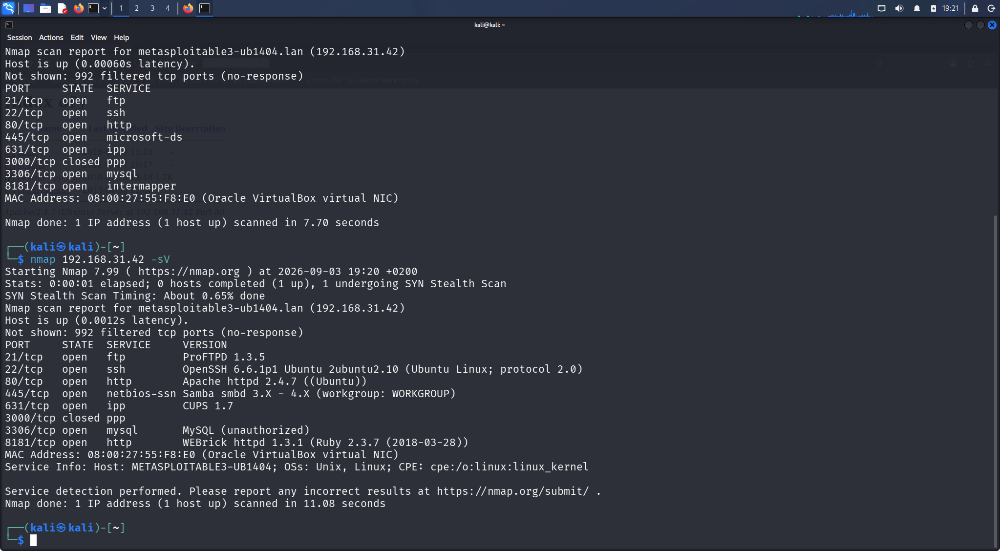
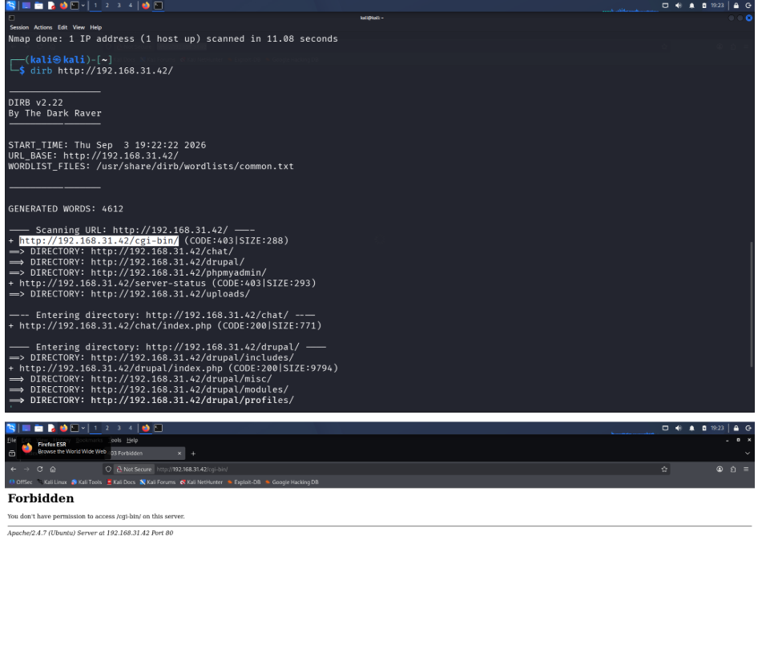
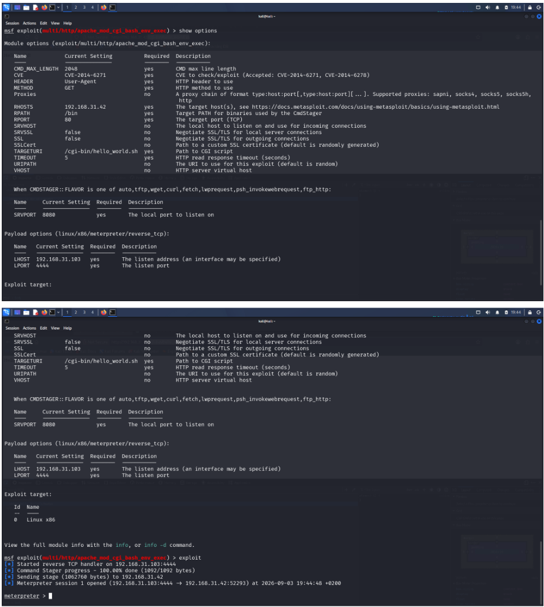
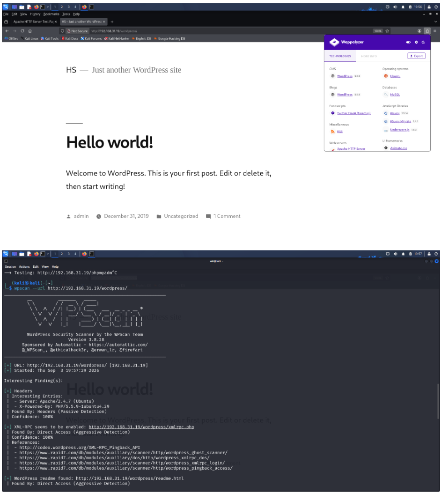
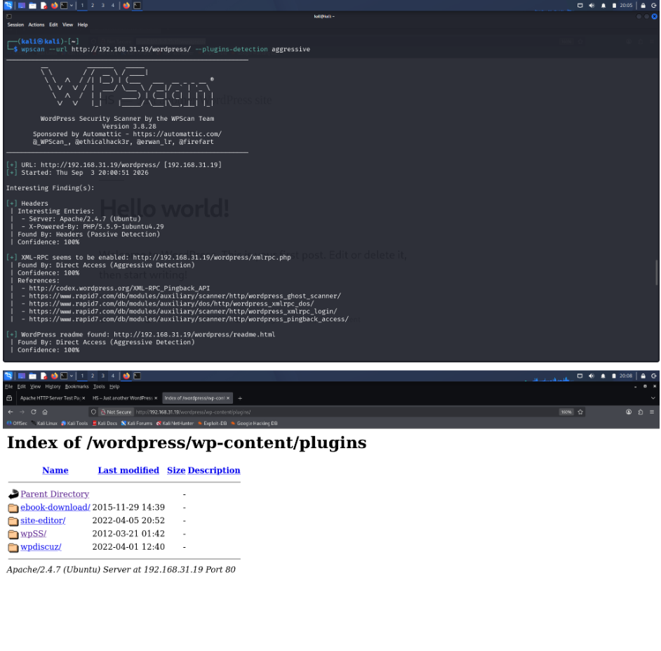
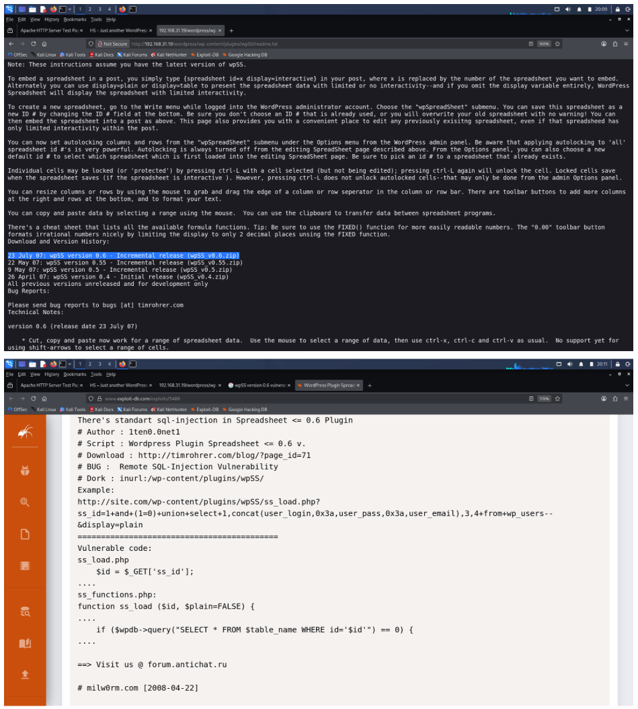
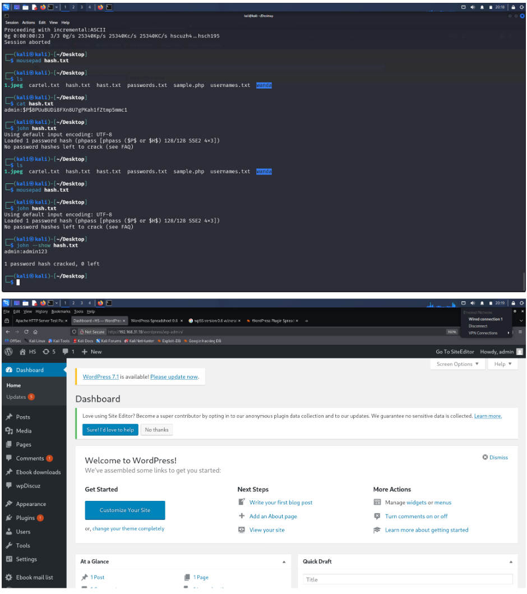
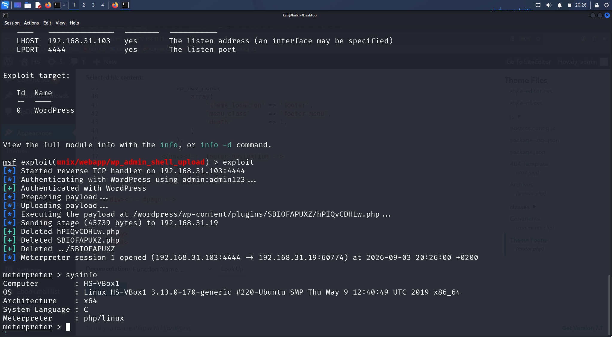

# Software Supply Chain – Web Application Security Lab

A hands-on web application security assessment focused on identifying vulnerabilities introduced through outdated software, scripts, and third-party WordPress plugins in an isolated laboratory environment.

## 1. Lab Summary

| Category | Details |
|---|---|
| Vulnerability Focus | Software Supply Chain / Outdated Components |
| Environment | Isolated Cybersecurity Lab |
| Attacker Machine | Kali Linux |
| Target Machines | Metasploitable / WordPress Target |
| Web Server | Apache |
| Application | WordPress |
| Tools | Nmap, WPScan, Metasploit |
| Testing Type | Authorized Security Testing |

---

## 2. Overview

Software supply chain vulnerabilities can occur when applications depend on outdated, vulnerable, or poorly maintained software components.

In this lab, the assessment focused on identifying vulnerable legacy components and demonstrating how outdated software can expose web applications to known attacks.

The lab covered two main scenarios:

1. An outdated Bash/CGI configuration vulnerable to **Shellshock**.
2. An outdated WordPress plugin vulnerable to **SQL Injection**, followed by exploitation through available WordPress administrative access.

---

## 3. Lab Objectives

- Identify services and technologies running on target systems.
- Identify outdated software and scripts.
- Investigate legacy CGI/Bash functionality.
- Understand the security impact of outdated Bash components.
- Identify WordPress plugins using WPScan.
- Enumerate plugin versions and supporting files.
- Research known vulnerabilities associated with outdated components.
- Demonstrate exploitation of vulnerable software in the isolated lab.
- Obtain a reverse shell where applicable.
- Document the evidence and security impact of outdated components.

---

## 4. Target Enumeration

Initial enumeration was performed to identify available services and potential attack surfaces.

The lab environment included a Kali Linux attacker machine and target systems running vulnerable web services.

The assessment identified an Apache CGI endpoint containing a `.sh` script:

```text
http://192.168.31.42/cgi-bin/hello_world.sh
```

The `.sh` extension indicated that the endpoint was associated with a shell script being executed through the web server's CGI interface.

---
### Enumeration Evidence



**Evidence:** `evidence/01-target-enumeration.png`
## 5. Shellshock – Apache CGI / Bash

The CGI endpoint was investigated because legacy Bash CGI scripts can expose applications to the Shellshock vulnerability.

The lab referenced the Metasploit module:

```text
exploit/multi/http/apache/mod_cgi_bash_env_exec
```

The module description identifies the vulnerability as an Apache CGI/Bash environment-variable code injection issue.

The exploitation workflow included loading the module, reviewing its available options, configuring the required parameters, and executing it against the vulnerable CGI service.

### Key Finding

An outdated Bash/CGI configuration can allow malicious input supplied through HTTP environment variables to reach the Bash interpreter.

This demonstrates how legacy components within a web application stack can introduce significant security risk.

---

### Shellshock Evidence



**Evidence:** `evidence/02-shellshock-cgi.png`



**Evidence:** `evidence/03-metasploit-shellshock.png`

## 6. WordPress Plugin Enumeration

A second target running WordPress was assessed using WPScan.

The WordPress installation was identified at:

```text
http://192.168.31.19/wordpress/
```

WPScan was used to enumerate WordPress components and identify installed plugins.

An example plugin information file was identified at:

```text
http://192.168.31.19/wordpress/wp-content/plugins/wpSS/readme.txt
```

The plugin documentation revealed an old version:

```text
wpSS version 0.6
```

---

### WPScan Evidence



**Evidence:** `evidence/04-wpscan-enumeration.png`



**Evidence:** `evidence/05-wpss-plugin.png`

## 7. Vulnerable WordPress Plugin

The outdated `wpSS` plugin was investigated for known vulnerabilities.

The lab documentation identified:

| Field | Details |
|---|---|
| Plugin | Spreadsheet / wpSS |
| Version | 0.6 |
| Vulnerability | SQL Injection |
| CVE | CVE-2008-1982 |
| EDB-ID | 5486 |
| Platform | PHP |

The vulnerable functionality was associated with:

```text
ss_load.php
```

The documented vulnerable parameter was:

```text
ss_id
```

This demonstrated how an outdated third-party WordPress plugin can expose a web application to a known vulnerability.

---

### Vulnerability Evidence



**Evidence:** `evidence/06-wpss-vulnerability.png`

## 8. Exploitation and Post-Exploitation

The lab demonstrated exploitation of the outdated WordPress component and subsequent access to the WordPress administrative interface.

With WordPress administrative access available, Metasploit was used to demonstrate obtaining a reverse shell from the target environment.

The final stages of the lab show the configured Metasploit payload and the resulting session on the target.

---

### Exploitation Evidence



**Evidence:** `evidence/07-wordpress-admin.png`



**Evidence:** `evidence/08-reverse-shell.png`

## 9. Evidence

Screenshots documenting the assessment are stored in the `evidence/` directory.

The evidence includes:

- Initial target/service enumeration
- Shellshock CGI identification
- Metasploit Shellshock module configuration
- WordPress enumeration with WPScan
- Identification of the outdated `wpSS` plugin
- Vulnerability information for the plugin
- Exploitation activity
- WordPress administrative access
- Reverse shell configuration and session

---

## 10. Key Security Lessons

This lab demonstrates that software supply chain risk is not limited to the primary application itself.

Security weaknesses can be introduced through:

- Outdated operating-system components
- Legacy Bash scripts
- CGI configurations
- Outdated WordPress plugins
- Third-party software dependencies
- Components with publicly documented vulnerabilities

Regular component inventory, version management, vulnerability monitoring, and timely patching are therefore important parts of web application security.

---

## 11. Conclusion

The assessment demonstrated how outdated software components can provide attackers with exploitable attack paths.

Two scenarios were examined:

1. **Shellshock** through an Apache CGI/Bash configuration.
2. **SQL Injection** through an outdated WordPress plugin.

The lab highlights the importance of maintaining software dependencies, removing unsupported components, monitoring third-party plugins, and applying security updates to reduce software supply chain risk.

> **Disclaimer:** All testing was performed within an isolated cybersecurity laboratory environment for authorized security testing and educational purposes.
