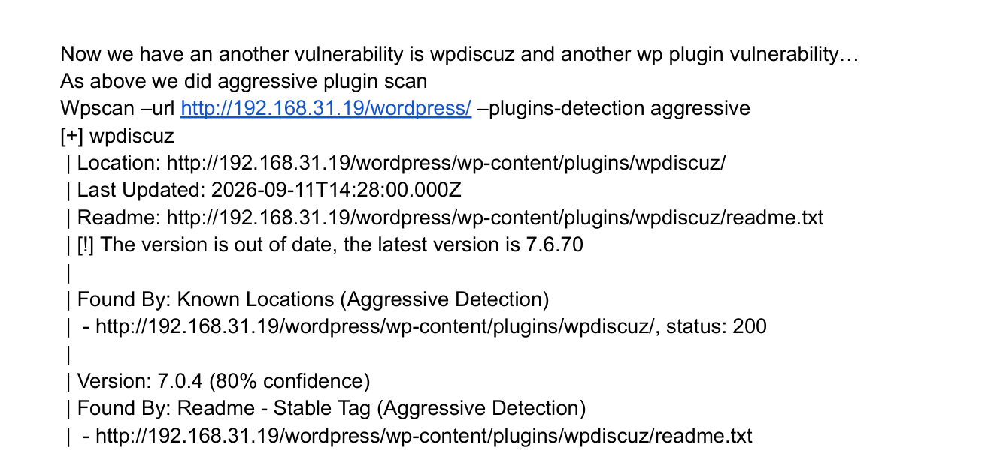
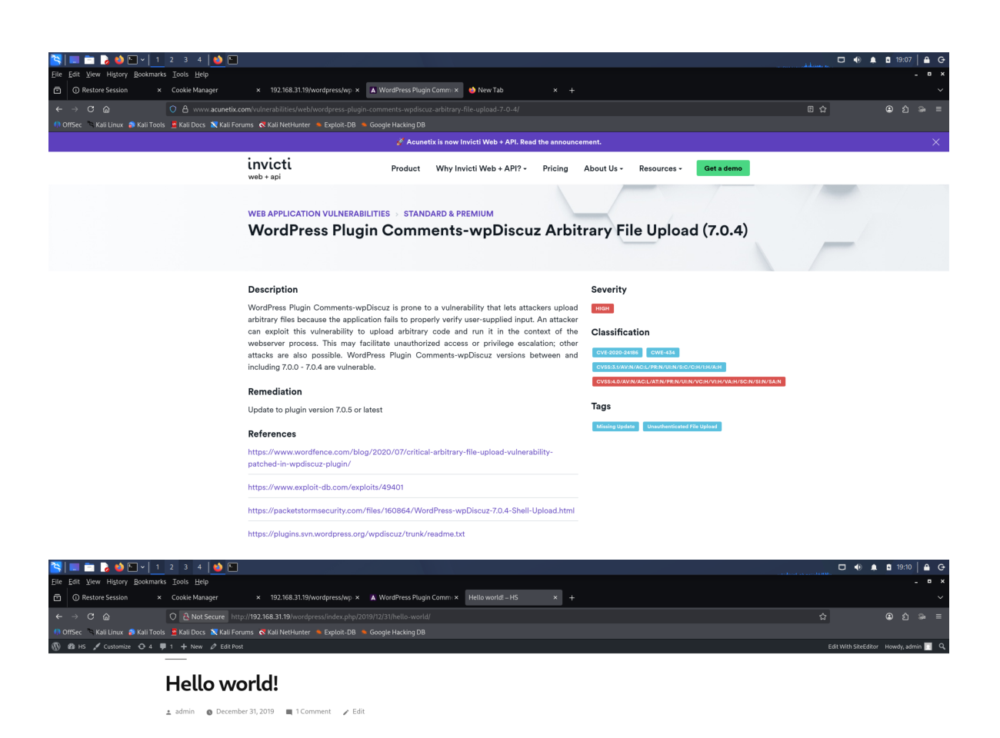
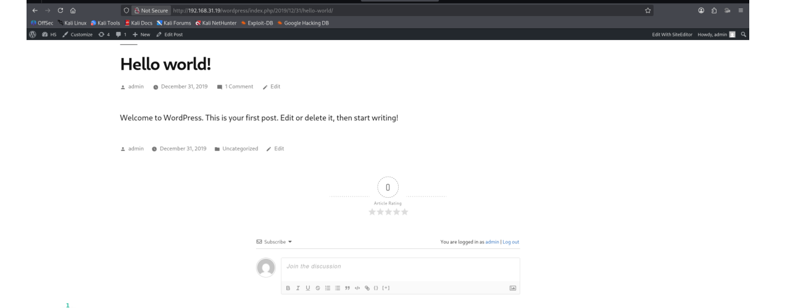
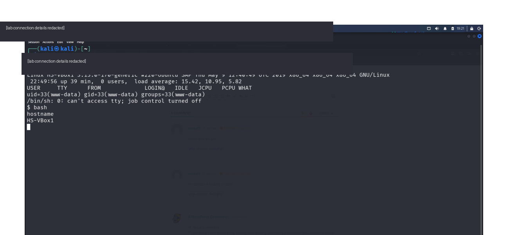

# Software Supply Chain – Web Application Security Lab

A hands-on web application security assessment focused on identifying vulnerabilities introduced through outdated software, scripts, and third-party WordPress plugins in an isolated laboratory environment.

## 1. Lab Summary

| Category | Details |
|---|---|
| **Vulnerability Focus** | Software Supply Chain / Outdated Components |
| **Environment** | Isolated Cybersecurity Lab |
| **Attacker Machine** | Kali Linux |
| **Target Machines** | Metasploitable / WordPress Target |
| **Web Server** | Apache |
| **Application** | WordPress |
| **Tools** | Nmap, WPScan, Metasploit |
| **Testing Type** | Authorized Security Testing |

---

## 2. Overview

Software supply chain vulnerabilities can occur when applications depend on outdated, vulnerable, or poorly maintained software components.

In this lab, the assessment focused on identifying vulnerable legacy components and demonstrating how outdated software can expose web applications to known attacks.

The lab covered three scenarios:

1. An outdated Bash/CGI configuration vulnerable to **Shellshock**.
2. An outdated WordPress plugin vulnerable to **SQL Injection**.
3. An outdated **wpDiscuz** WordPress plugin associated with an **arbitrary file upload** vulnerability.

> **Public documentation note:** Operational payloads, reverse-shell source code, and unnecessary connection details are intentionally omitted from this repository. The GitHub evidence focuses on vulnerability identification, validation, impact, and remediation.

---

## 3. Lab Objectives

- Identify services and technologies running on target systems.
- Identify outdated software and scripts.
- Investigate legacy CGI/Bash functionality.
- Understand the security impact of outdated Bash components.
- Identify WordPress plugins using WPScan.
- Enumerate plugin versions and supporting files.
- Research known vulnerabilities associated with outdated components.
- Demonstrate exploitation of vulnerable software in the isolated lab.
- Document the evidence and security impact of outdated components.
- Identify insecure file-upload functionality in a WordPress plugin.
- Recommend appropriate remediation and patching measures.

---

## 4. Target Enumeration

Initial enumeration was performed to identify available services and potential attack surfaces.

The lab environment included a Kali Linux attacker machine and target systems running vulnerable web services.

The assessment identified an Apache CGI endpoint containing a `.sh` script:

```text
http://192.168.31.42/cgi-bin/hello_world.sh
```

The `.sh` extension indicated that the endpoint was associated with a shell script being executed through the web server's CGI interface.

### Enumeration Evidence


**Evidence:** `evidence/01-target-enumeration.png`

---

## 5. Shellshock – Apache CGI / Bash

The CGI endpoint was investigated because legacy Bash CGI scripts can expose applications to the Shellshock vulnerability.

The lab referenced the Metasploit module:

```text
exploit/multi/http/apache/mod_cgi_bash_env_exec
```

The module description identifies the vulnerability as an Apache CGI/Bash environment-variable code injection issue.

The exploitation workflow included loading the module, reviewing its available options, configuring the required parameters, and executing it against the vulnerable CGI service.

### Key Finding

An outdated Bash/CGI configuration can allow malicious input supplied through HTTP environment variables to reach the Bash interpreter.

This demonstrates how legacy components within a web application stack can introduce significant security risk.

### Shellshock Evidence


**Evidence:** `evidence/02-shellshock-cgi.png`


**Evidence:** `evidence/03-metasploit-shellshock.png`

---

## 6. WordPress Plugin Enumeration

A second target running WordPress was assessed using WPScan.

The WordPress installation was identified at:

```text
http://192.168.31.19/wordpress/
```

WPScan was used to enumerate WordPress components and identify installed plugins.

An example plugin information file was identified at:

```text
http://192.168.31.19/wordpress/wp-content/plugins/wpSS/readme.txt
```

The plugin documentation revealed an old version:

```text
wpSS version 0.6
```

### WPScan Evidence


**Evidence:** `evidence/04-wpscan-enumeration.png`


**Evidence:** `evidence/05-wpss-plugin.png`

---

## 7. Vulnerable WordPress Plugin – wpSS

The outdated `wpSS` plugin was investigated for known vulnerabilities.

The lab documentation identified:

| Field | Details |
|---|---|
| **Plugin** | Spreadsheet / wpSS |
| **Version** | 0.6 |
| **Vulnerability** | SQL Injection |
| **CVE** | CVE-2008-1982 |
| **EDB-ID** | 5486 |
| **Platform** | PHP |

The vulnerable functionality was associated with:

```text
ss_load.php
```

The documented vulnerable parameter was:

```text
ss_id
```

This demonstrated how an outdated third-party WordPress plugin can expose a web application to a known vulnerability.

### Vulnerability Evidence


**Evidence:** `evidence/06-wpss-vulnerability.png`

---

## 8. Exploitation and Post-Exploitation

The lab demonstrated exploitation of the outdated WordPress component and subsequent access to the WordPress administrative interface.

With WordPress administrative access available, Metasploit was used to demonstrate obtaining a reverse shell from the target environment.

The final stages of the lab show the configured payload and resulting session on the target.

### Exploitation Evidence


**Evidence:** `evidence/07-wordpress-admin.png`


**Evidence:** `evidence/08-reverse-shell.png`

---

## 9. wpDiscuz – Outdated WordPress Plugin

The assessment was extended to another WordPress component, **wpDiscuz**, using WPScan aggressive plugin detection.

The lab identified the plugin at:

```text
wp-content/plugins/wpdiscuz/
```

WPScan reported:

| Field | Details |
|---|---|
| **Plugin** | wpDiscuz |
| **Detected Version** | 7.0.4 |
| **Confidence** | 80% |
| **Latest Version Reported by WPScan** | 7.6.70 |
| **Finding** | Installed version was out of date |

The version was identified through the plugin's `readme.txt` stable tag during aggressive detection.

### wpDiscuz Enumeration Evidence



**Evidence:** `evidence/09-wpdiscuz-enumeration.png`

---

## 10. wpDiscuz – Arbitrary File Upload

The lab documentation referenced an advisory describing an **arbitrary file upload** vulnerability affecting wpDiscuz 7.0.4.

The advisory shown in the lab material identified:

| Field | Details |
|---|---|
| **Affected Component** | WordPress Comments – wpDiscuz |
| **Affected Version** | 7.0.4 |
| **Vulnerability** | Arbitrary File Upload |
| **CVE** | CVE-2020-24186 |
| **Severity in referenced advisory** | High |
| **Recommended Remediation in advisory** | Update to 7.0.5 or later |

The vulnerability was relevant because the comment functionality exposed a file-upload surface that did not adequately restrict user-supplied content.

### Vulnerability Evidence



**Evidence:** `evidence/10-wpdiscuz-vulnerability.png`

### File Upload Surface

The lab screenshot shows the wpDiscuz comment interface and its user-supplied content area.



**Evidence:** `evidence/11-wpdiscuz-file-upload.png`

> Payload source code and operational upload instructions are intentionally excluded from this public repository.

---

## 11. Controlled Session Evidence

The lab demonstrated the security impact of the vulnerable component by obtaining a controlled session on the isolated target environment.

The public evidence has been sanitized to remove unnecessary lab connection details.



**Evidence:** `evidence/12-controlled-session.png`

---

## 12. Security Impact

The lab demonstrates that outdated software components can create multiple attack paths within a web application environment.

Potential impacts observed or demonstrated in the isolated lab included:

- Remote code execution through vulnerable legacy CGI/Bash components.
- SQL injection through an outdated WordPress plugin.
- Compromise of WordPress administrative functionality.
- Insecure file-upload behavior in a third-party plugin.
- Potential server-side code execution when uploaded content is improperly handled.
- Increased attack surface caused by outdated third-party components.

---

## 13. Defensive Recommendations

### Software and Dependency Management

- Maintain an inventory of installed software and third-party components.
- Remove unsupported or unnecessary components.
- Apply security updates promptly.
- Monitor plugin versions and security advisories.
- Avoid retaining legacy CGI/Bash functionality when it is not required.

### WordPress Security

- Keep WordPress core and plugins updated.
- Remove unused plugins.
- Use trusted and actively maintained plugins.
- Restrict access to administrative functionality.
- Monitor plugin changes and unexpected files.

### File Upload Security

- Allow only required file types.
- Validate file content rather than relying only on file extensions.
- Store uploaded files outside executable web directories where possible.
- Disable script execution in upload directories.
- Apply server-side MIME/content validation.
- Enforce appropriate authentication and authorization controls.

### Monitoring

- Monitor web-server and application logs.
- Alert on suspicious plugin changes and unexpected uploads.
- Review administrative account activity.
- Regularly scan third-party dependencies for known vulnerabilities.

---

## 14. Key Security Lessons

This lab demonstrates that software supply chain risk is not limited to the primary application itself.

Security weaknesses can be introduced through:

- Outdated operating-system components
- Legacy Bash scripts
- CGI configurations
- Outdated WordPress plugins
- Third-party software dependencies
- Components with publicly documented vulnerabilities
- Insecure plugin functionality

Regular component inventory, version management, vulnerability monitoring, secure configuration, and timely patching are important parts of web application security.

---

## 15. Evidence Summary

The `evidence/` directory contains sanitized screenshots documenting:

1. Initial target/service enumeration
2. Shellshock CGI identification
3. Metasploit Shellshock module configuration
4. WordPress enumeration with WPScan
5. Identification of the outdated `wpSS` plugin
6. wpSS SQL injection vulnerability
7. WordPress administrative access
8. Reverse shell demonstration
9. wpDiscuz plugin enumeration
10. wpDiscuz arbitrary file-upload vulnerability
11. wpDiscuz comment/file-upload surface
12. Controlled session evidence

---

## 16. Conclusion

The assessment demonstrated how outdated software components and third-party plugins can provide attackers with exploitable attack paths.

Three areas were examined:

1. **Shellshock** through an Apache CGI/Bash configuration.
2. **SQL Injection** through an outdated WordPress plugin.
3. **Arbitrary file upload** through an outdated wpDiscuz plugin.

The lab highlights the importance of maintaining software dependencies, removing unsupported components, monitoring third-party plugins, validating uploaded content, and applying security updates to reduce software supply chain risk.

> **Disclaimer:** All testing was performed within an isolated cybersecurity laboratory environment for authorized security testing and educational purposes.
