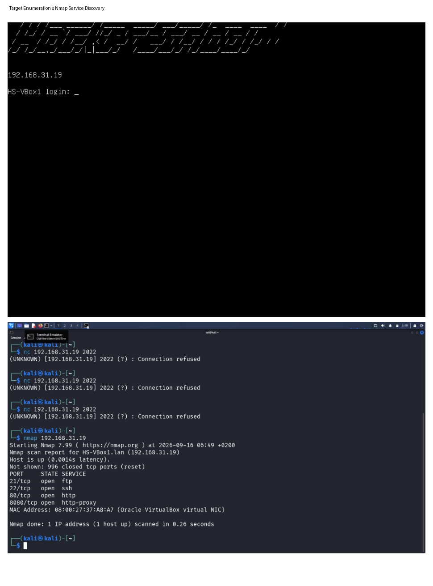
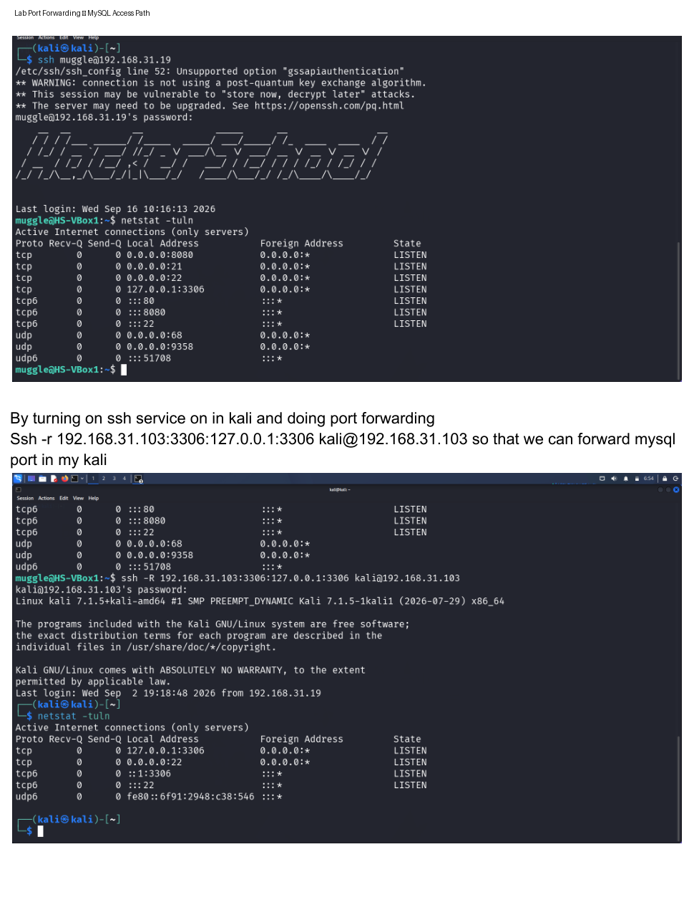
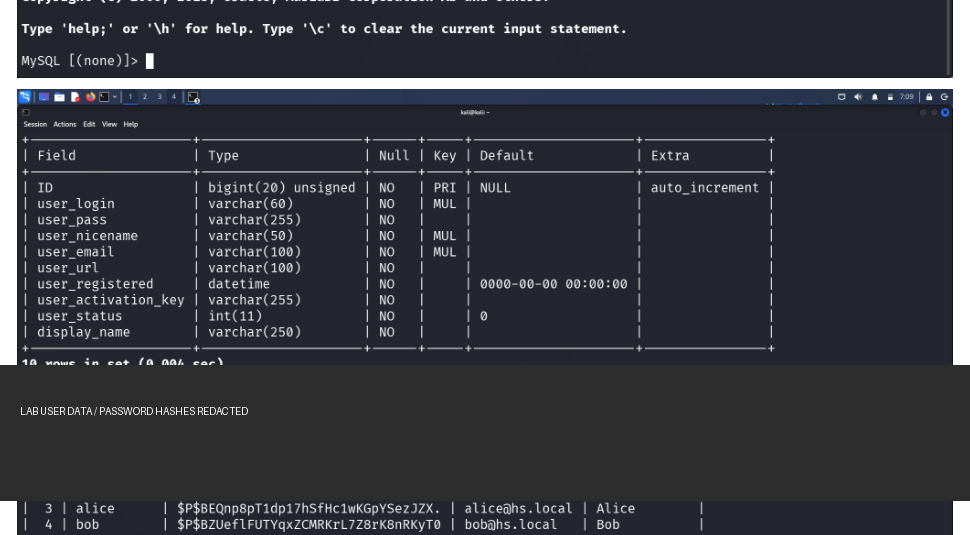
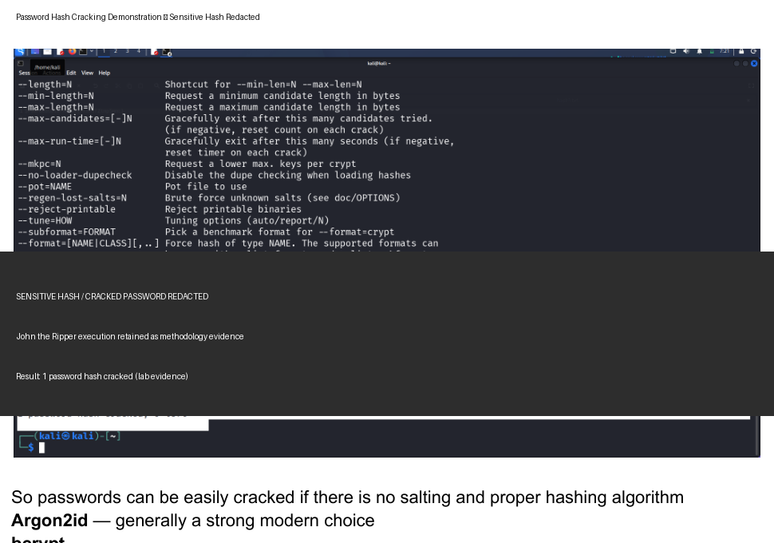

# Cryptographic Failures – Web Application Security Lab

A hands-on web application security lab focused on **cryptographic failures in password storage**, including weak/unsalted password hashes and the practical impact of recoverable passwords.

## 1. Lab Summary

| Category | Details |
|---|---|
| Vulnerability Focus | Cryptographic Failures |
| Environment | Isolated Cybersecurity Lab |
| Attacker Machine | Kali Linux |
| Target | WordPress / MariaDB lab environment |
| Services Observed | SSH, FTP, HTTP, HTTP Proxy |
| Database | MariaDB |
| Tools | Nmap, SSH, MariaDB client, John the Ripper |
| Testing Type | Authorized Security Testing |

## 2. Overview

Cryptographic failures can occur when sensitive information is protected using weak or outdated cryptographic practices.

In this lab, the focus was on password storage. The assessment demonstrated how password hashes stored without appropriate salting and with weak password-hashing practices can become vulnerable to offline password-cracking attempts.

The lab workflow included:

1. Enumerating the target services.
2. Establishing access to the lab database through port forwarding.
3. Inspecting the WordPress user table and password-storage fields.
4. Extracting password-hash data in the isolated lab.
5. Demonstrating password recovery with John the Ripper.
6. Reviewing modern password-hashing recommendations.

## 3. Target Enumeration

Initial Nmap enumeration identified an active lab host and exposed services.

Observed services included:

- FTP
- SSH
- HTTP
- HTTP Proxy

See:

### Target Enumeration Evidence

## 4. Database Access Through Port Forwarding

The lab environment required access to a database service that was bound to the target's local interface.

SSH port forwarding was used to make the database reachable from the Kali machine within the authorized lab environment.

See:

### Port Forwarding Evidence

This demonstrates an important penetration-testing concept: services that are not directly exposed externally can sometimes become reachable through an authenticated or controlled network path.

## 5. Password Storage Analysis

After obtaining database access, the WordPress user table was inspected.

The table structure included a `user_pass` field used for storing password representations.

The lab evidence showed password hashes that were suitable for offline password-cracking analysis.

For public documentation, user records, hashes, emails, and lab credentials have been intentionally redacted.

See:

### Password Storage Evidence

## 6. Password Hash Cracking Demonstration

John the Ripper was used against a password hash obtained from the isolated lab database.

The exercise demonstrated the security impact of weak password-storage practices: once password hashes are exposed, attackers can perform offline guessing/cracking without repeatedly interacting with the application.

The public evidence retains the cracking methodology and result while redacting the actual password hash and recovered password.

### Password Cracking Evidence

## 7. Security Impact

Weak password hashing can lead to:

- Password recovery through offline attacks
- Credential reuse attacks against other services
- Account compromise
- Increased impact after a database breach
- Exposure of sensitive user accounts

Password hashes should therefore be treated as sensitive security data even though they are not plaintext passwords.

## 8. Defensive Recommendations

Password storage should use a password-hashing algorithm designed to resist offline attacks.

The lab notes identify the following modern choices:

- **Argon2id** — generally a strong modern choice
- **bcrypt**
- **scrypt**
- **PBKDF2** where compatibility requirements apply

Additional recommendations:

- Use a unique salt for every password.
- Never store plaintext passwords.
- Use appropriate work factors / cost parameters.
- Protect database backups and credential stores.
- Apply least-privilege access to database accounts.
- Monitor for credential exposure.
- Encourage users to use unique passwords.

## 9. Key Security Lessons

This lab demonstrated several important concepts:

- Service enumeration is an important first step in an assessment.
- Internal services may become accessible through controlled network paths.
- Password hashes require strong storage mechanisms even when plaintext passwords are never stored.
- Salting helps prevent identical passwords from producing identical stored hashes and increases resistance to precomputed attacks.
- Password-hashing algorithms should be designed specifically for password storage rather than general-purpose fast hashing.
- Database compromise can have significant downstream authentication impact.

## 10. Evidence

All public evidence is stored in the `evidence/` directory.

| Evidence | Description |
|---|---|
| `01-target-enumeration.png` | Nmap service enumeration |
| `02-port-forwarding.png` | SSH port-forwarding workflow |
| `03-database-password-storage.png` | WordPress database schema and password-storage analysis |
| `04-password-cracking.png` | John the Ripper cracking demonstration |

### Public Evidence Sanitization

Sensitive lab information has intentionally been removed from the public evidence, including:

- Password hashes
- Recovered passwords
- Lab credentials
- Other authentication-sensitive values

The screenshots still preserve the relevant methodology and security findings for portfolio review.

## 11. Conclusion

The assessment demonstrated how inadequate password-storage practices can turn a database exposure into a credential-compromise risk.

The main lesson is that secure password storage requires purpose-built password-hashing algorithms, unique salts, appropriate computational cost, and strong protection of the underlying credential database.

> **Disclaimer:** All testing was performed within an isolated cybersecurity laboratory environment for authorized security testing and educational purposes.

